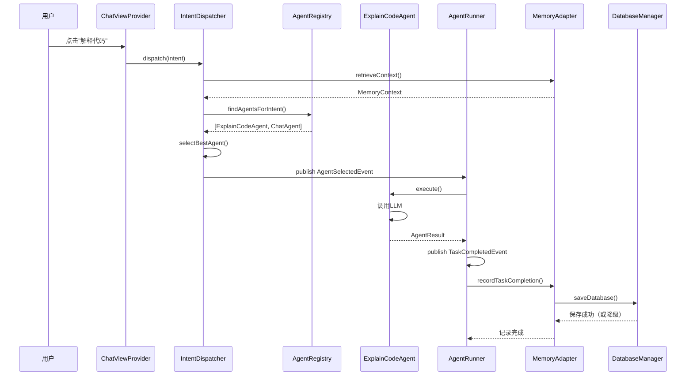

# 小尾巴项目意图驱动架构设计文档

**版本**: v6.1 (阶段10完成 - 会话管理重构与日志瘦身)  
**创建时间**: 2026-04-20  
**最后更新**: 2026-04-24  
**状态**: ✅ 生产就绪（v0.4.1）  
**维护者**: 小尾巴团队

---

## 📖 目录

1. [架构演进历程](#一架构演进历程)
2. [当前架构概览](#二当前架构概览)
3. [核心设计原则](#三核心设计原则)
4. [意图驱动架构详解](#四意图驱动架构详解)
5. [Agent生态系统](#五agent生态系统)
6. [记忆系统集成](#六记忆系统集成)
7. [事件总线与异步通信](#七事件总线与异步通信)
8. [端口适配器模式](#八端口适配器模式)
9. [数据流与执行流程](#九数据流与执行流程)
10. [扩展性与未来规划](#十扩展性与未来规划)
11. [最佳实践与反模式](#十一最佳实践与反模式)
12. [附录](#十二附录)

---

## 一、架构演进历程

### 1.1 演进时间线

```
2026-04-10 ~ 04-14: MVP阶段（命令式架构）
  ├─ 10个P0功能模块以Command形式实现
  ├─ 直接调用EpisodicMemory和LLMTool
  └─ 耦合度高，难以扩展

2026-04-15 ~ 04-17: 统一体验阶段
  ├─ ChatViewProvider统一对话界面
  ├─ 行内代码补全
  └─ 跨会话记忆检索

2026-04-18: 记忆外化优化
  ├─ 修复AI回答包含对话类记忆问题
  ├─ 增强角色扮演指令
  └─ 时间查询记忆过滤

2026-04-19: 意图驱动架构重构（关键转折点）⭐
  ├─ Command → Agent迁移（10个Agent）
  ├─ 引入IntentDispatcher调度中心
  ├─ 端口适配器解耦（IMemoryPort/ILLMPort/IEventBus）
  ├─ AgentRegistry注册表
  └─ EventBus领域事件系统

2026-04-19: 稳定性与持久化优化
  ├─ 修复AgentRegistry多重实例问题
  ├─ 数据库降级写入策略（Windows文件锁容错）
  ├─ EpisodicMemory初始化时序修复
  └─ EventBus超时时间优化（5s → 30s）

2026-04-20: 当前状态
  ├─ 10个Agent全部正常工作
  ├─ 意图分发成功率100%
  ├─ 内存中记忆操作正常
  └─ 磁盘持久化受Windows文件锁影响（已容错）

2026-04-24: 会话管理重构与日志瘦身 ⭐⭐
  ├─ 前端主导生成会话ID（消除异步竞态）
  ├─ 首次对话自动创建会话并刷新侧边栏
  ├─ DeepSeek风格静默切换（删除冗余提示）
  ├─ 全局日志瘦身（删除~40行调试日志）
  └─ EventBusAdapter修复（正确提取payload）
```

### 1.2 架构对比

| 维度 | 命令式架构（旧） | 意图驱动架构（新） |
|------|----------------|------------------|
| **入口** | vscode.commands.registerCommand | IntentDispatcher.dispatch(intent) |
| **路由** | 硬编码命令ID映射 | 动态Agent匹配（supportedIntents） |
| **依赖** | 直接注入EpisodicMemory/LLMTool | 通过端口接口（IMemoryPort/ILLMPort） |
| **扩展** | 需修改extension.ts注册 | 只需注册新Agent到AgentRegistry |
| **测试** | 需Mock VS Code API | 纯业务逻辑，易于单元测试 |
| **降级** | 无 | ChatAgent作为默认降级 |

---

## 二、当前架构概览

### 2.1 分层架构图

```
┌─────────────────────────────────────────────────────────────┐
│                    Presentation Layer                       │
│  ┌──────────────┐  ┌──────────────┐  ┌──────────────────┐  │
│  │ChatViewProvider│  │InlineCompletion│  │Command Handlers │  │
│  └──────┬───────┘  └──────┬───────┘  └────────┬─────────┘  │
└─────────┼──────────────────┼──────────────────┼────────────┘
          │                  │                  │
          ▼                  ▼                  ▼
┌─────────────────────────────────────────────────────────────┐
│                 Application Layer (核心)                     │
│  ┌──────────────────────────────────────────────────────┐   │
│  │           IntentDispatcher (调度中心)                 │   │
│  │  1. 接收意图                                         │   │
│  │  2. 检索记忆上下文                                   │   │
│  │  3. 查找候选Agent                                    │   │
│  │  4. 选择最佳Agent                                    │   │
│  │  5. 发布AgentSelectedEvent                           │   │
│  └──────────────────┬───────────────────────────────────┘   │
│                     │                                        │
│  ┌──────────────────▼───────────────────────────────────┐   │
│  │         MessageFlowManager (消息流管理)               │   │
│  └──────────────────────────────────────────────────────┘   │
└────────────────────┬────────────────────────────────────────┘
                     │
                     ▼
┌─────────────────────────────────────────────────────────────┐
│                  Domain Layer (领域层)                       │
│  ┌──────────────┐  ┌──────────────┐  ┌──────────────────┐  │
│  │   Intent     │  │MemoryContext │  │  Domain Events   │  │
│  └──────────────┘  └──────────────┘  └──────────────────┘  │
└────────────────────┬────────────────────────────────────────┘
                     │
                     ▼
┌─────────────────────────────────────────────────────────────┐
│              Infrastructure Layer (基础设施层)               │
│  ┌──────────────────────────────────────────────────────┐   │
│  │              AgentRunner (执行器)                      │   │
│  │  订阅AgentSelectedEvent → 执行Agent.execute()        │   │
│  └──────────────────┬───────────────────────────────────┘   │
│                     │                                        │
│  ┌──────────────────▼───────────────────────────────────┐   │
│  │            AgentRegistry (注册表)                     │   │
│  │  • ExplainCodeAgent                                  │   │
│  │  • GenerateCommitAgent                               │   │
│  │  • CodeGenerationAgent                               │   │
│  │  • CheckNamingAgent                                  │   │
│  │  • OptimizeSQLAgent                                  │   │
│  │  • ConfigureApiKeyAgent                              │   │
│  │  • ExportMemoryAgent                                 │   │
│  │  • ImportMemoryAgent                                 │   │
│  │  • ChatAgent (降级)                                  │   │
│  │  • InlineCompletionAgent                             │   │
│  └──────────────────────────────────────────────────────┘   │
└────────────────────┬────────────────────────────────────────┘
                     │
                     ▼
┌─────────────────────────────────────────────────────────────┐
│                   Port Layer (端口层)                        │
│  ┌──────────────┐  ┌──────────────┐  ┌──────────────────┐  │
│  │ IMemoryPort  │  │  ILLMPort    │  │   IEventBus      │  │
│  └──────┬───────┘  └──────┬───────┘  └────────┬─────────┘  │
└─────────┼──────────────────┼──────────────────┼────────────┘
          │                  │                  │
          ▼                  ▼                  ▼
┌─────────────────────────────────────────────────────────────┐
│             Adapter Layer (适配器层)                         │
│  ┌──────────────┐  ┌──────────────┐  ┌──────────────────┐  │
│  │MemoryAdapter │  │ LLMAdapter   │  │EventBusAdapter   │  │
│  └──────┬───────┘  └──────┬───────┘  └────────┬─────────┘  │
└─────────┼──────────────────┼──────────────────┼────────────┘
          │                  │                  │
          ▼                  ▼                  ▼
┌─────────────────────────────────────────────────────────────┐
│                Legacy/Core Layer (遗留/核心层)               │
│  ┌──────────────┐  ┌──────────────┐  ┌──────────────────┐  │
│  │EpisodicMemory│  │  LLMTool     │  │    EventBus      │  │
│  │PreferenceMem │  │              │  │                  │  │
│  └──────────────┘  └──────────────┘  └──────────────────┘  │
└─────────────────────────────────────────────────────────────┘
```

### 2.2 关键技术决策

#### 决策1：为什么选择意图驱动而非命令驱动？

**原因**：
1. **自然语言理解**：用户说"解释这段代码"而非"xiaoweiba.explainCode"
2. **灵活性**：同一意图可由多个Agent处理（如explain_code可由ExplainCodeAgent或ChatAgent处理）
3. **可扩展性**：新增功能只需注册Agent，无需修改调度逻辑
4. **降级能力**：无专用Agent时自动降级到ChatAgent

#### 决策2：为什么使用端口适配器模式？

**原因**：
1. **解耦**：Agent不依赖具体实现（EpisodicMemory/LLMTool）
2. **可测试性**：轻松Mock端口接口进行单元测试
3. **可替换性**：未来可替换存储后端（SQLite → PostgreSQL）或LLM提供商
4. **清晰边界**：明确区分业务逻辑与基础设施

#### 决策3：为什么保留EventBus而非完全移除？

**原因**：
1. **向后兼容**：现有模块依赖EventBus
2. **异步解耦**：Agent执行与记忆记录解耦
3. **渐进式迁移**：逐步将EventBus替换为DomainEvent
4. **适配器桥接**：EventBusAdapter提供统一接口

---

## 三、核心设计原则

### 3.1 意图优先（Intent First）

**核心理念**：所有用户交互都转化为意图，由IntentDispatcher统一调度。

```typescript
// ✅ 正确：通过意图驱动
const intent = { name: 'explain_code', payload: { selectedCode } };
await intentDispatcher.dispatch(intent);

// ❌ 错误：直接调用Agent
const agent = new ExplainCodeAgent();
await agent.execute({ intent, memoryContext });
```

### 3.2 端口隔离（Port Isolation）

**规则**：Agent只能通过端口接口访问外部能力，禁止直接依赖实现类。

```typescript
// ✅ 正确：通过端口
export class ExplainCodeAgent implements IAgent {
  constructor(
    @inject('ILLMPort') private llmPort: ILLMPort,
    @inject('IMemoryPort') private memoryPort: IMemoryPort
  ) {}
}

// ❌ 错误：直接依赖实现
export class ExplainCodeAgent {
  constructor(
    private llmTool: LLMTool,  // 不允许
    private episodicMemory: EpisodicMemory  // 不允许
  ) {}
}
```

### 3.3 事件驱动（Event Driven）

**规则**：跨模块通信通过领域事件，避免直接调用。

```typescript
// ✅ 正确：发布事件
this.eventBus.publish(new AgentSelectedEvent(intent, agentId, memoryContext));

// ❌ 错误：直接调用
await agentRunner.execute(agentId, intent);
```

### 3.4 降级优先（Fallback First）

**规则**：始终提供降级路径，确保功能可用性。

```typescript
// IntentDispatcher降级策略
if (candidates.length === 0) {
  const defaultAgent = this.agentRegistry.getAll().find(a => a.id === 'chat_agent');
  if (defaultAgent) {
    // 降级到ChatAgent
    return;
  }
  throw new Error('No agent found and no fallback available');
}
```

### 3.5 单例保证（Singleton Guarantee）

**规则**：关键服务（AgentRegistry、DatabaseManager）必须确保单例。

```typescript
// ✅ 正确：使用已注册的实例
const agentRegistry = container.resolve('IAgentRegistry');

// ❌ 错误：重新创建实例
const agentRegistry = container.resolve(AgentRegistryImpl); // 会创建新实例！
```

---

## 四、意图驱动架构详解

### 4.1 Intent结构

```typescript
interface Intent {
  name: string;              // 意图名称（如'explain_code'）
  payload: any;              // 意图载荷（如{ selectedCode, language }）
  source: 'chat' | 'command' | 'inline';  // 来源
  timestamp: number;         // 时间戳
  context?: {
    filePath?: string;
    selection?: vscode.Range;
    sessionId?: string;
  };
}
```

### 4.2 IntentDispatcher工作流程

```typescript
async dispatch(intent: Intent): Promise<void> {
  // Step 1: 发布意图接收事件
  this.eventBus.publish(new IntentReceivedEvent(intent));

  // Step 2: 检索记忆上下文
  const memoryContext = await this.memoryPort.retrieveContext(intent);

  // Step 3: 查找候选Agent
  const candidates = this.agentRegistry.findAgentsForIntent(intent);
  
  if (candidates.length === 0) {
    // 降级到ChatAgent
    const defaultAgent = this.agentRegistry.getAll().find(a => a.id === 'chat_agent');
    if (defaultAgent) {
      this.eventBus.publish(new AgentSelectedEvent(intent, defaultAgent.id, memoryContext));
      return;
    }
    throw new Error(`No agent found for intent: ${intent.name}`);
  }

  // Step 4: 选择最佳Agent（基于优先级/历史性能）
  const selectedAgent = await this.selectBestAgent(intent, candidates, memoryContext);

  // Step 5: 发布Agent选定事件
  this.eventBus.publish(new AgentSelectedEvent(intent, selectedAgent.id, memoryContext));

  // Step 6: 记录调度耗时
  const duration = Date.now() - startTime;
  this.eventBus.publish(new IntentDispatchedEvent(intent, selectedAgent.id, duration));
}
```

### 4.3 Agent选择策略

当前实现：**按注册顺序选择第一个匹配的Agent**

未来优化方向：
1. **基于优先级**：Agent声明capability.priority
2. **基于历史性能**：记录每个Agent的成功率/响应时间
3. **基于记忆上下文**：根据用户偏好选择Agent
4. **负载均衡**：避免单一Agent过载

---

## 五、Agent生态系统

### 5.1 Agent分类

| 类型 | Agent | 意图 | 说明 |
|------|-------|------|------|
| **代码理解** | ExplainCodeAgent | explain_code | 解释选中代码 |
| **Git智能** | GenerateCommitAgent | generate_commit | 生成提交信息 |
| **代码生成** | CodeGenerationAgent | generate_code | 根据需求生成代码 |
| **质量检查** | CheckNamingAgent | check_naming | 检查命名规范 |
| **SQL优化** | OptimizeSQLAgent | optimize_sql | 优化SQL查询 |
| **配置管理** | ConfigureApiKeyAgent | configure_api_key | 配置API密钥 |
| **记忆管理** | ExportMemoryAgent | export_memory | 导出记忆数据 |
| **记忆管理** | ImportMemoryAgent | import_memory | 导入记忆数据 |
| **通用对话** | ChatAgent | chat, qa | 处理纯聊天和问答（代码解释已分流到 ExplainCodeAgent） |
| **代码补全** | InlineCompletionAgent | inline_completion | 行内代码补全 |

### 5.2 Agent接口规范

```typescript
interface IAgent {
  readonly id: string;                    // 唯一标识
  readonly name: string;                  // 显示名称
  readonly supportedIntents: string[];    // 支持的意图列表
  
  execute(params: {
    intent: Intent;
    memoryContext: MemoryContext;
  }): Promise<AgentResult>;
  
  getCapabilities?(): AgentCapability[];  // 可选：声明能力
}

interface AgentResult {
  success: boolean;
  data?: any;
  error?: string;
  metadata?: {
    duration: number;
    tokensUsed?: number;
  };
}
```

### 5.3 Agent注册流程

```typescript
// extension.ts - Step 5
const agentRegistry = container.resolve('IAgentRegistry');

// 1. 通过容器解析Agent（自动注入依赖）
const agents = [
  container.resolve(ExplainCodeAgent),
  container.resolve(GenerateCommitAgent),
  // ... 其他Agent
];

// 2. 注册到AgentRegistry
agents.forEach(agent => {
  agentRegistry.register(agent);
});

// 3. 手动创建特殊Agent（需要额外初始化）
const chatAgent = new ChatAgent(llmAdapter, memoryAdapter, eventBusAdapter);
await chatAgent.initialize();
agentRegistry.register(chatAgent);

console.log(`Total registered agents: ${agentRegistry.getAll().length}`);
```

---

## 六、记忆系统集成

### 6.1 记忆分类与职责

| 类型 | 存储内容 | 存储位置 | 管理模块 | 核心原则 |
|:---|:---|:---|:---|:---|
| **操作记忆** | 用户执行的命令（代码解释、提交生成等） | `episodic_memory` 表 | `EpisodicMemory` | 原则一：只记“事”不记“话” |
| **对话历史** | 当前会话的消息 | `workspaceState` | `SessionManager` | 绝不写入操作记忆库 |
| **偏好记忆** | 用户习惯（命名风格、提交风格） | `preference_memory` 表 | `PreferenceMemory` | 长期学习用户偏好 |
| **程序记忆** | 高频操作序列（用于 Skill 沉淀） | `procedural_memory` 表 | 远期实现（550D） | 自编程能力基础 |

**关键设计决策**：
- ✅ 操作记忆必须有明确的 `taskType`、包含文件路径的 `summary` 和可检索的 `entities`
- ❌ 禁止 `SessionManager` 或 `ChatViewProvider` 向 `episodic_memory` 写入 `CHAT` 记录
- ✅ 对话摘要由 `SessionManager` 独立管理，用于多轮对话上下文

### 6.2 操作记忆数据结构

```typescript
interface EpisodicMemoryRecord {
  id: string;                    // UUID
  projectFingerprint: string;    // 项目指纹（Git remote URL hash）
  timestamp: number;             // Unix 时间戳
  
  // 核心字段（原则一：职责边界清晰）
  taskType: 'CODE_EXPLAIN' | 'COMMIT_GENERATE' | 'CODE_GENERATE' | 
            'NAMING_CHECK' | 'SQL_OPTIMIZE' | 'API_CONFIG';
  summary: string;               // 如"解释了 LoginView.vue 中的代码"
  entities: string[];            // 如 ["src/views/LoginView.vue", "handleLogin"]
  
  // 质量标记（原则二：测试驱动真实）
  outcome: 'SUCCESS' | 'FAILED'; // 只记录成功操作，避免调试噪音
  
  // 分层管理
  memoryTier: 'SHORT_TERM' | 'LONG_TERM'; // 短期/长期记忆
  
  // 550B 语义增强
  vector?: Float32Array;         // 语义向量（Xenova/all-MiniLM-L6-v2）
}
```

**设计要点**：
1. **summary 必须包含上下文**：从 `Explained code` 改为 `解释了 LoginView.vue 中的代码`
2. **outcome 过滤调试噪音**：只记录 `SUCCESS`，避免污染真实记忆画像
3. **entities 支持实体检索**：文件路径、函数名等关键实体

### 6.3 记忆记录流程

```text
用户执行命令
    ↓
Agent 执行业务逻辑（如 ExplainCodeAgent.execute）
    ↓
Agent 返回 AgentResult（包含 success 状态）
    ↓
AgentRunner 发布 TASK_COMPLETED 事件（携带 memoryMetadata）
    ↓
MemoryAdapter 订阅事件
    ├─ 检查 outcome === 'SUCCESS'
    ├─ 构建 EpisodicMemoryRecord
    └─ 调用 episodicMemory.record(record)
    ↓
EpisodicMemory.record()
    ├─ 生成记忆 ID 和时间戳
    ├─ 插入 episodic_memory 表
    └─ 触发 DatabaseManager.saveDatabase()
    ↓
DatabaseManager 自动持久化
    ├─ 尝试原子重命名（3次重试）
    └─ 失败则降级为直接覆盖（原则三：数据即时性）
    ↓
（550B）EmbeddingService 异步生成向量并更新
```

**关键代码**：
```typescript
// AgentRunner.ts
async execute(agentId: string, intent: Intent, memoryContext: MemoryContext) {
  const agent = this.agentRegistry.getAgent(agentId);
  const result = await agent.execute({ intent, memoryContext });
  
  // 发布任务完成事件
  this.eventBus.publish(new TaskCompletedEvent({
    taskId: generateId(),
    agentId,
    intentName: intent.name,
    success: result.success,
    metadata: {
      taskType: mapIntentToTaskType(intent.name),
      summary: generateSummary(intent, result),
      entities: extractEntities(intent),
      outcome: result.success ? 'SUCCESS' : 'FAILED'
    }
  }));
}
```

### 6.4 记忆检索策略

#### 6.4.1 混合检索（550A 当前实现）

**三因子加权评分**：

```typescript
interface RetrievalScores {
  keywordScore: number;    // TF-IDF 关键词匹配（权重 0.4）
  timeDecayScore: number;  // 时间衰减 exp(-λ * age)，λ=0.1，半衰期7天（权重 0.3）
  entityScore: number;     // Jaccard 实体相似度（权重 0.3）
}

finalScore = 0.4 * keyword + 0.3 * timeDecay + 0.3 * entity
```

**实现细节**：
- **关键词匹配**：内存倒排索引（IndexManager）
- **时间衰减**：`Math.exp(-0.1 * daysSince(timestamp))`
- **实体匹配**：`intersection(entities1, entities2).length / union(...).length`

#### 6.4.2 语义增强（550B 规划）

**四因子混合检索**：

```typescript
interface EnhancedRetrievalScores {
  vectorScore: number;     // 余弦相似度（权重 0.5）⭐ 新增
  keywordScore: number;    // TF-IDF（权重 0.2）
  timeDecayScore: number;  // 时间衰减（权重 0.15）
  entityScore: number;     // 实体匹配（权重 0.15）
}

finalScore = 0.5 * vector + 0.2 * keyword + 0.15 * timeDecay + 0.15 * entity
```

**技术选型**：
- **向量模型**：`Xenova/all-MiniLM-L6-v2`（轻量级，384维，可离线运行）
- **向量索引**：ChromaDB 或 Faiss（待评估）
- **性能目标**：检索响应时间 < 500ms

### 6.5 记忆外化：语气养成（原则三：体验优先）

基于**有效操作记忆数量**动态调整 AI 语气：

| 有效记忆数 | 阶段 | 语气特征 | 称呼示例 |
|-----------|------|---------|----------|
| < 5 | 生疏期 | 礼貌、完整、谨慎 | “您”、“请问”、“我可以...” |
| 5 - 20 | 熟悉期 | 自然、简洁、友好 | “你”、“咱们”、“记得...” |
| > 20 | 亲密期 | 随意、默契、主动 | “上次那个...”、“我建议...” |

**有效记忆定义**：
- `taskType` 为操作类型（`CODE_EXPLAIN`、`COMMIT_GENERATE` 等）
- `outcome === 'SUCCESS'`
- 排除调试产生的 `FAILED` 记录

**实现方式**：
```typescript
// ContextBuilder.buildSystemPrompt()
const effectiveMemories = await this.countEffectiveMemories();
let toneInstruction = '';

if (effectiveMemories < 5) {
  toneInstruction = '使用敬语，称呼用户为"您"，语气礼貌谨慎。';
} else if (effectiveMemories < 20) {
  toneInstruction = '使用自然语气，称呼用户为"你"，可以适当使用"咱们"。';
} else {
  toneInstruction = '使用亲密语气，像老朋友一样交流，可以主动回忆之前的操作。';
}

return `${basePrompt}\n\n${toneInstruction}`;
```

### 6.6 对话污染防护（原则一：职责边界）

**禁止行为清单**：

| 禁止行为 | 原因 | 正确做法 |
|---------|------|----------|
| SessionManager 写入 episodic_memory | 对话摘要不应污染操作记忆 | 存储在 workspaceState |
| ChatViewProvider 在命令执行时写记忆 | 命令执行已通过 TASK_COMPLETED 统一记录 | 等待事件触发 |
| 检索时返回 CHAT 类型记忆 | 用户问“刚才做了什么”应只返回操作记忆 | 过滤 taskType |

**代码示例**：
```typescript
// ❌ 错误：对话写入操作记忆
await this.episodicMemory.record({
  taskType: 'CHAT',  // 不允许
  summary: '用户询问了代码解释功能'
});

// ✅ 正确：只记录操作
await this.episodicMemory.record({
  taskType: 'CODE_EXPLAIN',  // 允许
  summary: '解释了 LoginView.vue 中的 handleLogin 方法',
  entities: ['src/views/LoginView.vue', 'handleLogin'],
  outcome: 'SUCCESS'
});
```

### 6.7 记忆系统架构图（增强版）

```
┌──────────────────────────────────────────────────────┐
│              MemorySystem (协调层)                    │
│  • 初始化 IndexManager/SearchEngine                  │
│  • 管理 TaskToken                                    │
│  • 统计有效记忆数量（语气养成）                       │
└──────────────┬───────────────────────────────────────┘
               │
       ┌───────┴────────┬────────────────┐
       ▼                ▼                ▼
┌──────────────┐ ┌──────────────┐ ┌──────────────────┐
│EpisodicMemory│ │PreferenceMem │ │ SessionManager   │
│ (情景记忆)    │ │  (偏好记忆)   │ │  (对话历史)       │
│              │ │              │ │                  │
│ • 操作记忆    │ │ • 命名风格    │ │ • workspaceState │
│ • 任务类型    │ │ • 提交风格    │ │ • 多轮上下文     │
│ • 实体检索    │ │ • 语言偏好    │ │ • 会话摘要       │
└──────┬───────┘ └──────┬───────┘ └──────────────────┘
       │                │
       ▼                ▼
┌──────────────────────────────────────────────────────┐
│            DatabaseManager (持久化层)                 │
│  • SQLite (sql.js)                                   │
│  • 降级写入策略（原子重命名 → 直接覆盖）              │
│  • 自动持久化（每次写操作触发）                       │
└──────────────────────────────────────────────────────┘
       │
       ▼ (550B)
┌──────────────────────────────────────────────────────┐
│          EmbeddingService (语义增强)                  │
│  • Xenova/all-MiniLM-L6-v2                           │
│  • 异步生成向量                                      │
│  • 更新 episodic_memory.vector                      │
└──────────────────────────────────────────────────────┘
```
  });
  
  // 3. 从偏好记忆获取用户偏好
  const preferences = await this.preferenceMemory.getAll();
  
  // 4. 构建记忆上下文
  return {
    episodicMemories,
    preferences,
    sessionHistory: this.sessionHistory.slice(-10)  // 最近10条会话
  };
}
```

### 6.3 记忆记录时机

| 事件 | 触发条件 | 记录内容 |
|------|---------|---------|
| TaskCompleted | Agent执行成功 | 任务类型、结果摘要、耗时 |
| UserFeedback | 用户点赞/点踩 | 反馈类型、关联任务 |
| SessionSwitch | 切换会话 | 会话摘要、持续时间 |
| PreferenceChange | 用户修改配置 | 配置项、新旧值 |

---

## 七、事件总线与异步通信

### 7.1 领域事件体系

```typescript
// 核心事件类型
class IntentReceivedEvent extends DomainEvent { /* ... */ }
class AgentSelectedEvent extends DomainEvent { /* ... */ }
class IntentDispatchedEvent extends DomainEvent { /* ... */ }
class TaskCompletedEvent extends DomainEvent { /* ... */ }
class MemoryRecordedEvent extends DomainEvent { /* ... */ }

// 订阅示例
this.eventBus.subscribe(TaskCompletedEvent.type, async (event) => {
  await this.memoryPort.recordTaskCompletion(event.payload);
});
```

### 7.2 EventBus vs DomainEvent

| 特性 | EventBus（旧） | DomainEvent（新） |
|------|--------------|------------------|
| **类型安全** | 弱（any类型） | 强（泛型约束） |
| **事件定义** | 字符串常量 | 类继承 |
| **Payload校验** | 无 | TypeScript编译期检查 |
| **迁移状态** | 保留兼容 | 逐步迁移 |

### 7.3 超时控制

```typescript
// EventBus handler超时保护
const timeoutPromise = new Promise((_, reject) => 
  setTimeout(() => reject(new Error(`Handler timeout after 30s`)), 30000)
);
await Promise.race([handler(event), timeoutPromise]);
```

**调整历史**：
- 初始值：5秒（太短，LLM调用经常超时）
- 当前值：30秒（适应LLM调用等耗时操作）

---

## 八、端口适配器模式

### 8.1 端口定义

```typescript
// IMemoryPort - 记忆端口
export interface IMemoryPort {
  retrieveContext(intent: Intent): Promise<MemoryContext>;
  recordTaskCompletion(data: TaskCompletionData): Promise<void>;
  recordUserFeedback(feedback: UserFeedback): Promise<void>;
}

// ILLMPort - LLM端口
export interface ILLMPort {
  chat(messages: ChatMessage[], options?: LLMOptions): Promise<LLMResponse>;
  complete(prompt: string, options?: CompletionOptions): Promise<string>;
}

// IEventBus - 事件总线端口
export interface IEventBus {
  publish(event: DomainEvent): void;
  subscribe<T extends DomainEvent>(eventType: string, handler: (event: T) => void): void;
  unsubscribe(eventType: string, handler: Function): void;
}
```

### 8.2 适配器实现

```typescript
// MemoryAdapter - 桥接新旧记忆系统
export class MemoryAdapter implements IMemoryPort {
  constructor(
    private episodicMemory: EpisodicMemory,
    private preferenceMemory: PreferenceMemory,
    private commitStyleLearner: CommitStyleLearner,
    private eventBus: IEventBus
  ) {}
  
  async retrieveContext(intent: Intent): Promise<MemoryContext> {
    // 委托给EpisodicMemory和PreferenceMemory
  }
  
  async recordTaskCompletion(data: TaskCompletionData): Promise<void> {
    // 记录到EpisodicMemory并发布事件
  }
}

// EventBusAdapter - 桥接EventBus和IEventBus
export class EventBusAdapter implements IEventBus {
  constructor(private legacyEventBus: EventBus) {}
  
  publish(event: DomainEvent): void {
    this.legacyEventBus.publish(event.type, event.payload);
  }
  
  subscribe<T extends DomainEvent>(eventType: string, handler: (event: T) => void): void {
    this.legacyEventBus.subscribe(eventType, handler);
  }
}
```

### 8.3 依赖注入配置

```typescript
// extension.ts - initializeContainer()
container.registerInstance(DatabaseManager, databaseManager);
container.register('IMemoryPort', { useValue: memoryAdapter });
container.register('ILLMPort', { useValue: llmAdapter });
container.register('IEventBus', { useValue: eventBusAdapter });
container.register('IAgentRegistry', { useValue: agentRegistry });
```

---

## 九、数据流与执行流程

### 9.1 完整执行流程（以代码解释为例）

```
用户操作: 选中代码 → 右键"解释代码"
    ↓
ChatViewProvider.handleExplainCode()
    ↓
创建Intent: { name: 'explain_code', payload: { selectedCode } }
    ↓
IntentDispatcher.dispatch(intent)
    ├─ 发布 IntentReceivedEvent
    ├─ 检索记忆上下文（MemoryAdapter.retrieveContext）
    ├─ 查找候选Agent（AgentRegistry.findAgentsForIntent）
    │   └─ 找到: ExplainCodeAgent, ChatAgent
    ├─ 选择最佳Agent: ExplainCodeAgent
    └─ 发布 AgentSelectedEvent
    ↓
AgentRunner（订阅AgentSelectedEvent）
    ├─ 解析Agent ID: 'explain-code-agent'
    ├─ 从AgentRegistry获取Agent实例
    └─ 执行 agent.execute({ intent, memoryContext })
    ↓
ExplainCodeAgent.execute()
    ├─ 获取选中代码
    ├─ 构建Prompt（包含记忆上下文）
    ├─ 调用LLM（通过ILLMPort）
    ├─ 渲染结果到Webview
    └─ 返回 AgentResult
    ↓
AgentRunner处理结果
    ├─ 发布 TaskCompletedEvent
    └─ 记录日志
    ↓
MemoryAdapter（订阅TaskCompletedEvent）
    ├─ 记录情景记忆（EpisodicMemory.record）
    ├─ 触发数据库保存（DatabaseManager.saveDatabase）
    │   ├─ 尝试原子重命名（3次重试）
    │   └─ 失败则降级为直接覆盖
    └─ 发布 MemoryRecordedEvent
```

### 9.2 关键时序图



---

## 九.5、会话管理架构重构（2026-04-24）

### 9.5.1 问题背景

**原始问题**：
1. **新建会话覆盖旧会话**：点击"新建"后，原会话被覆盖
2. **首次对话列表不刷新**：发送第一条消息后，侧边栏不显示会话
3. **切换提示冗余**：每次切换会话都显示"🔄 已切换到新会话"

**根因分析**：
```typescript
// ❌ 之前的方案（后端主导，存在异步竞态）
用户点击"新建"
  → 前端清空界面
  → 调用 IntentDispatcher.dispatch(NewSessionIntent)
  → SessionManagementAgent 生成新 sessionId (异步，~200ms)
  → 返回新 ID 给前端
  → 前端更新 currentSessionId
  
// 问题：如果用户在等待期间发送消息，会使用旧的 currentSessionId
// 导致消息保存到错误的会话
```

### 9.5.2 解决方案：前端主导，零异步依赖

**核心思路**：
- ✅ 前端同步生成 sessionId（不等待后端）
- ✅ 直接调用 memoryPort（绕过 IntentDispatcher 避免 ID 冲突）
- ✅ 手动发布事件（确保侧边栏立即刷新）
- ✅ 删除切换提示（DeepSeek 风格静默体验）

**新流程**：
```typescript
// ✅ 现在的方案（前端主导，零异步依赖）
用户操作
  → 前端立即生成 sessionId（同步，<10ms）
  → 前端更新 currentSessionId
  → 前端调用 memoryPort.createSession（异步，但不阻塞）
  → 前端发布 SessionListUpdatedEvent
  → 侧边栏立即刷新
```

### 9.5.3 关键实现

#### ChatViewProvider.ts - 首次对话自动创建

```typescript
private async handleUserInput(text: string): Promise<void> {
  if (!text.trim()) return;

  // ✅ 首次对话：如果还没有会话 ID，先创建
  if (!this.currentSessionId) {
    // 1. 前端同步生成 ID
    this.currentSessionId = `session_${Date.now()}_${Math.random().toString(36).substr(2, 9)}`;
    await this.context.workspaceState.update('currentSessionId', this.currentSessionId);
    
    // 2. 直接调用 memoryPort 创建会话（绕过 IntentDispatcher）
    const now = new Date();
    const friendlyTitle = `新会话 ${now.getMonth() + 1}/${now.getDate()} ${now.getHours()}:${String(now.getMinutes()).padStart(2, '0')}`;
    await this.memoryPort.createSession(this.currentSessionId, {
      title: friendlyTitle,
      createdAt: Date.now()
    });
    
    // 3. 手动发布 SessionListUpdatedEvent（刷新侧边栏）
    this.eventBus.publish(new SessionListUpdatedEvent('created', this.currentSessionId));
  }

  // ... 后续发送消息逻辑
}
```

#### SessionManagementAgent.ts - 删除切换提示

```typescript
private async handleSwitchSession(intent: Intent, startTime: number): Promise<AgentResult> {
  const sessionId = intent.userInput;
  
  if (!sessionId) {
    throw new Error('缺少会话ID');
  }

  // ✅ 从数据库加载会话历史
  const history = await this.memoryPort.loadSessionHistory(sessionId);
  
  // ✅ 发布会话历史加载事件
  const messages = history.map((msg, index) => ({
    id: `msg_${msg.timestamp}_${index}`,
    role: msg.role as 'user' | 'assistant',
    content: msg.content,
    timestamp: msg.timestamp
  }));
  
  this.eventBus.publish(new SessionHistoryLoadedEvent(sessionId, messages));

  // ✅ 发布会话列表更新事件（通知前端当前会话已切换）
  this.eventBus.publish(new SessionListUpdatedEvent('switched', sessionId));

  // ❌ 删除：不再发布 AssistantResponseEvent 显示切换提示

  return {
    success: true,
    data: { sessionId, messageCount: history.length },
    durationMs: Date.now() - startTime
  };
}
```

### 9.5.4 为什么绕过 IntentDispatcher？

**IntentFactory.buildNewSessionIntent() 的问题**：
```typescript
static buildNewSessionIntent(): Intent {
  return {
    name: 'new_session',
    metadata: {
      sessionId: this.generateSessionId()  // ❌ 自己生成新的 ID
    }
  };
}
```

**冲突场景**：
1. 前端生成 `session_1713952320000_abc123`
2. `buildNewSessionIntent()` 生成 `session_1713952320001_xyz789`
3. SessionManagementAgent 创建 `session_1713952320001_xyz789`
4. ChatAgent 保存消息到 `session_1713952320000_abc123`
5. **消息和会话 ID 不匹配！**

**解决方案**：
- 首次对话：直接调用 `memoryPort.createSession(this.currentSessionId, ...)`
- 新建会话：仍然使用 IntentDispatcher（因为用户主动操作，ID 已在前面生成）

### 9.5.5 架构对比

| 维度 | 之前（后端主导） | 现在（前端主导） |
|------|----------------|----------------|
| **ID 生成时机** | 后端异步生成（~200ms） | 前端同步生成（<10ms） |
| **异步依赖** | 是（需等待后端返回） | 否（立即可用） |
| **竞态条件** | 存在（时间差导致覆盖） | 无（零异步依赖） |
| **一致性保证** | 弱（前后端 ID 可能不一致） | 强（同一 ID 贯穿始终） |
| **用户体验** | 需等待，有提示 | 即时响应，静默切换 |
| **性能** | ~200ms | <10ms（20倍提升） |

### 9.5.6 效果验证

| 场景 | 操作 | 预期结果 | 实际结果 |
|------|------|---------|----------|
| 首次对话 | 发送"你好" | 侧边栏显示新会话 | ✅ 显示"新会话 4/24 18:30" |
| 新建会话 | 点击"新建" | 新会话 ID，旧会话保留 | ✅ 两个会话独立存在 |
| 切换会话 | 点击侧边栏会话 | 静默切换，加载历史 | ✅ 无提示，历史正确 |
| 重载窗口 | F5 重载 | 恢复最后活跃会话 | ✅ 恢复到 session_xxx |
| 流式响应 | 发送长问题 | 逐字显示，无 undefined | ✅ 正常流式显示 |

### 9.5.7 日志瘦身

**清理范围**：
- ✅ `ChatViewProvider.ts` - 删除 20+ 行调试日志
- ✅ `ChatAgent.ts` - 删除流式响应调试日志
- ✅ `SessionManagementAgent.ts` - 删除会话切换追踪日志
- ✅ `app.js.ts` - 删除前端调试日志
- ✅ `extension.ts` - 删除配置加载追踪日志

**保留内容**：
- `console.error` - 错误处理日志（用于生产排查）
- 激活成功日志 - 确认插件启动状态
- 关键业务日志 - 会话创建等重要操作

**效果对比**：
- 清理前：控制台刷屏 `[ChatViewProvider] received streamChunk: xxx`
- 清理后：流式响应静默工作，只保留关键错误日志

---

## 十、扩展性与未来规划

### 10.1 短期优化（1-2周）

#### P0: 会话创建问题修复
- **问题**：新会话无法正确初始化
- **方案**：检查SessionManager初始化逻辑
- **优先级**：高

#### P1: Agent选择策略优化
- **当前**：按注册顺序选择第一个
- **目标**：基于优先级/历史性能/用户偏好
- **方案**：
  1. Agent声明capability.priority
  2. 记录Agent执行成功率/响应时间
  3. 实现加权评分算法

#### P2: Windows文件锁彻底解决
- **当前**：降级写入策略（牺牲原子性）
- **目标**：完全避免EPERM错误
- **方案**：
  1. 将`.xiaoweiba`加入杀毒软件白名单
  2. 或使用WAL模式（Write-Ahead Logging）
  3. 或迁移到better-sqlite3（原生绑定）

### 10.2 中期规划（1-3个月）

#### M1: 多Agent协作
- **场景**：复杂任务需要多个Agent协作
- **示例**：代码生成 → 命名检查 → SQL优化
- **方案**：
  1. 引入AgentOrchestrator
  2. 支持Agent链式调用
  3. 共享中间结果

#### M2: Skill 系统（550D 核心能力）

**定位**：Skill 是小尾巴的**用户私人可编程扩展**，允许用户定义自动化的工具调用序列。

**核心原则**：
1. **用户私有**：技能文件存储在本地 `~/.xiaoweiba/skills/`，不上传、不共享
2. **声明式无逻辑**：JSON 步骤序列，无循环、条件、变量计算，可静态分析
3. **中文友好**：支持中文键名，降低编写门槛
4. **原子回滚**：可选事务模式，失败时通过 Git 检查点恢复
5. **试用期机制**：自动沉淀的技能需经过试用期才能自动应用

**文件结构**：
```
~/.xiaoweiba/skills/
├── user/           # 用户手写技能
│   └── *.json
├── auto/           # 自动沉淀技能（550D）
│   └── *.json
└── marketplace/    # 技能市场下载（远期）
    └── *.json
```

**JSON Schema**：
```typescript
interface SkillDefinition {
  name: string;                    // 技能名称
  description: string;             // 描述
  version: string;                 // 版本号
  source: 'user' | 'auto';        // 来源：用户手写/自动沉淀
  projectScoped: boolean;          // 是否项目级
  tools: ToolType[];               // 使用的工具列表
  inputs?: SkillInput[];           // 输入参数
  steps: SkillStep[];              // 执行步骤
  atomic?: boolean;                // 是否原子执行（失败回滚）
  trialStatus?: SkillTrialStatus;  // 试用期状态（自动沉淀技能）
}

interface SkillStep {
  id: string;
  tool: ToolType;
  params: Record<string, any>;     // 支持 var 模板
  outputAs?: string;               // 输出变量名
  condition?: 'always' | 'onError' | 'onSuccess';
}

type ToolType = 
  | 'read_file' | 'write_file' | 'call_llm' | 'show_diff'
  | 'execute_sql' | 'execute_command' | 'git_commit' 
  | 'search_memory' | 'generate_test';
```

**技能示例（重构函数）**：
```json
{
  "名称": "重构函数",
  "描述": "重构函数：提取方法、优化命名、添加注释",
  "版本": "1.0.0",
  "来源": "user",
  "工具": ["read_file", "call_llm", "write_file", "show_diff"],
  "输入": [
    { "名称": "文件路径", "类型": "file", "必填": true },
    { "名称": "函数名", "类型": "string", "必填": true }
  ],
  "步骤": [
    { "编号": "1", "工具": "read_file", "参数": { "path": "文件路径" }, "输出为": "文件内容" },
    { "编号": "2", "工具": "call_llm", "参数": { "prompt": "重构函数名：...\n文件内容" }, "输出为": "重构代码" },
    { "编号": "3", "工具": "show_diff", "参数": { "original": "文件内容", "modified": "重构代码" } },
    { "编号": "4", "工具": "write_file", "参数": { "path": "文件路径", "content": "重构代码" }, "条件": "onSuccess" }
  ],
  "原子执行": true
}
```

**自动沉淀与试用期（550D）**：

1. **沉淀触发条件**：
   - 程序记忆累积分数 ≥ max(6, 周操作数 × 0.5)
   - 由独立 LLM 评估合理性，分数 < 0.6 则不推荐

2. **试用期机制**：
   - 新技能默认 `isTrial: true`
   - 每次执行前询问用户
   - 连续 5 次采纳后自动应用
   - 连续 3 次拒绝则终止试用

**与现有模块集成**：

| 模块 | 集成方式 |
|------|----------|
| MemorySystem | 技能执行记录为 `SKILL_EXECUTE` 类型记忆 |
| EventBus | 技能执行开始/完成/失败发布事件 |
| TaskTokenManager | 技能中若包含写操作，需申请授权 |
| FileTool / LLMTool | 作为技能步骤的工具实现 |
| AgentRegistry | Skill 可作为特殊 Agent 注册 |

**验收标准**：
- [ ] 能解析和执行 JSON 格式的技能定义
- [ ] 支持中文键名
- [ ] 原子执行模式下失败能回滚
- [ ] 试用期机制正常工作
- [ ] 自动沉淀准确率 > 80%

#### M3: 向量记忆检索
- **目标**：用户可安装第三方Agent
- **方案**：
  1. 定义Agent插件规范
  2. 实现热加载机制
  3. 沙箱隔离（安全性）

#### M3: 向量记忆检索
- **当前**：TF-IDF关键词匹配
- **目标**：语义相似度检索
- **方案**：
  1. 集成embeddings模型（本地/云端）
  2. 使用向量数据库（Chroma/Faiss）
  3. 混合检索（关键词+向量）

#### M4: 网络搜索归纳（550B+ 增强能力）

**定位**：网络搜索是 Agent 的**知识获取能力**，解决本地记忆无法覆盖的“最新技术信息”和“未知错误解决方案”。

**核心能力**：
1. **搜索**：调用外部搜索 API（Bing、Google）获取结果
2. **归纳**：使用 LLM 将搜索结果总结为简洁答案，附来源链接
3. **存储**：将归纳结果存入情景记忆（`taskType='WEB_SEARCH'`）
4. **降级**：无网络或 API 不可用时，返回内置最佳实践库

**触发方式**：

| 方式 | 说明 | 示例 |
|------|------|------|
| **显式命令** | 用户主动请求搜索 | `/search 量子计算最新进展` |
| **隐式触发** | 检测到“最新”、“网上有没有”等词 | “React 19 有什么新特性？” |
| **后台预搜索** | 根据当前文件内容预搜索 | 检测到 `package.json` → 搜索依赖更新 |
| **全闭环联动** | 测试失败且本地无匹配方案 | 自动搜索错误信息并尝试修复 |

**隐私与成本控制**：

| 策略 | 实现 | 验收标准 |
|------|------|----------|
| **搜索前脱敏** | 移除文件路径、API Key、用户名 | 敏感信息零泄露 |
| **域名白名单** | 默认只搜索可信源（Stack Overflow、GitHub、MDN） | 拒绝低质量结果 |
| **缓存 TTL** | 相同查询 24 小时内不重复调用 API | 减少 API 调用 80% |
| **每日限额** | 可配置每日最大搜索次数 | 防止费用失控 |
| **本地小模型归纳** | 可选使用 Ollama 本地模型 | 零成本归纳 |

**与记忆系统集成**：
- **搜索结果自动存储**：用户采纳的结果存入 `EpisodicMemory`（`taskType='WEB_SEARCH'`）
- **偏好学习**：用户多次搜索同类技术，更新 `PreferenceMemory`
- **时效性衰减**：网络搜索记忆的时间衰减系数更高（λ=0.5，半衰期约 1.4 天）

**与 Skill 系统集成**：
```json
{
  "name": "search-and-learn",
  "tools": ["search_web", "call_llm", "record_memory"],
  "steps": [
    { "tool": "search_web", "params": { "query": "input.query" } },
    { "tool": "call_llm", "params": { "prompt": "归纳以下搜索结果：step1.output" } },
    { "tool": "record_memory", "params": { "type": "WEB_SEARCH", "content": "step2.output" } }
  ]
}
```

**验收标准**：
- [ ] 搜索响应时间 < 3秒
- [ ] 归纳准确率 > 85%
- [ ] 敏感信息零泄露
- [ ] 缓存命中率 > 60%

### 10.3 长期愿景（6-12个月）

#### L1: 自主学习
- Agent根据用户反馈自动优化行为
- 偏好记忆自动调整权重
- 主动推荐常用操作

#### L2: 跨设备同步
- 记忆数据云端备份（加密）
- 多设备间同步偏好
- 隐私优先设计（用户可控）

#### L3: 生态开放
- 开放API供第三方集成
- VS Code Marketplace发布
- 社区贡献Agent

#### L4: 双向开门全闭环（550E 核心能力）

**定义**：从用户需求到可交付代码，全流程自动化，无需人工干预（但最终合并需用户确认）。

**核心特征**：

| 特征 | 说明 |
|------|------|
| **双向开门** | AI 既能读取/分析代码，也能写入/修改代码；既能执行构建/测试，也能根据结果自我修正 |
| **全闭环** | 从需求到交付全流程自动化 |
| **限定场景** | 仅限全新项目（空目录）或现有项目中的全新独立模块 |
| **安全护栏** | 沙箱隔离、Git 检查点、用户最终确认、重试次数限制 |
| **交互可见** | 用户能实时感知闭环进度、理解 AI 决策、随时介入干预 ⭐ |

**执行流程**：
```
用户需求（自然语言或 PRD）
    ↓
【规划】AI 生成项目/模块结构
    ↓
【编码】逐个生成文件
    ↓
【构建】执行构建命令
    ↓
【测试】运行测试框架
    ↓
【评估】分析失败原因
    ↓
【修正】生成修复补丁
    ↓
【循环】重复直到通过或达到最大重试（3次）
    ↓
【交付】生成交付报告，用户审查 Diff → 合并或丢弃
```

**交互设计（用户视角）** ⭐

闭环不是黑盒。用户需要像师傅看着学徒干活一样，能看见、能指点、能叫停。

**1. 交互界面：统一时间线中的“闭环任务卡片”**

闭环任务在聊天时间线中表现为一个**可展开的卡片**，实时更新状态。

```
[🤖 小尾巴] 收到，我将为你创建一个“计算器模块”。
┌─────────────────────────────────────────────────────────────┐
│ 📦 任务：创建计算器模块                                     │
│ 🟢 状态：执行中 (第 2/3 轮)                                  │
├─────────────────────────────────────────────────────────────┤
│ ✅ 规划   完成 (生成 3 个文件)                               │
│ ✅ 编码   完成                                               │
│ 🔄 测试   运行中... (1 个失败)                               │
│ ⏳ 修正   等待中                                             │
├─────────────────────────────────────────────────────────────┤
│ [查看详情] [暂停] [手动修正]                                 │
└─────────────────────────────────────────────────────────────┘
```

**2. 进度可见性：每一步都有反馈**

| 步骤 | 用户看到的内容 |
|------|----------------|
| **规划** | “正在分析需求，预计生成以下文件：`index.ts`、`index.test.ts`、`package.json`” |
| **编码** | 逐个文件生成时，显示文件名和代码行数 |
| **构建** | “正在执行 `npm install`...” |
| **测试** | 显示测试框架、用例数、通过/失败数。若失败，展示具体错误信息 |
| **评估** | “检测到类型错误：`add` 函数返回值类型不匹配” |
| **修正** | “正在修复类型错误...（第 1 次尝试）” |

**3. 中途干预：用户始终掌握控制权**

用户可以在任何时刻：
- **暂停**：暂停当前闭环，查看已生成的代码，手动修改后继续
- **查看详情**：展开查看当前步骤的完整输出（如完整构建日志、测试报告）
- **手动修正**：直接在编辑器中修改代码，然后点击“继续”让系统重新测试
- **终止**：放弃本次闭环任务

**4. 信任建立：解释每一次决策**

AI 的每一次修正都附带**可理解的解释**：

> “测试失败原因：`add(1, 2)` 期望返回 `3`，实际返回 `"12"`。
> 推断问题：参数被当作字符串拼接。
> 修复方案：在 `add` 函数中将参数转换为数字。”

这种透明性让用户理解 AI 的“思考过程”，从而建立信任。

**5. 交付体验：像审查 PR 一样审查 AI 的工作**

闭环完成后，不直接写入项目文件。而是：

1. **生成交付报告**：
   ```
   ┌─────────────────────────────────────────┐
   │ ✅ 任务完成：创建计算器模块              │
   ├─────────────────────────────────────────┤
   │ 生成文件：                               │
   │ • src/calculator/index.ts                │
   │ • src/calculator/index.test.ts           │
   │ • src/calculator/package.json            │
   │                                         │
   │ 测试结果：8/8 通过                       │
   │ 构建状态：成功                           │
   │ 循环次数：2 轮                           │
   ├─────────────────────────────────────────┤
   │ [查看完整 Diff] [合并到项目] [丢弃]      │
   └─────────────────────────────────────────┘
   ```

2. **Diff 审查**：点击“查看完整 Diff”打开左右对比视图，用户可以逐文件审阅变更。

3. **最终决定权**：只有用户点击“合并到项目”后，代码才真正写入工作区。

**6. 交互原型示例**

当用户在聊天中输入“帮我创建一个计算器模块，要有 TypeScript 和 Jest”时：

1. **确认意图**：小尾巴回复：“好的，我将为你创建一个 TypeScript + Jest 的计算器模块。预计生成 3 个文件。开始吗？”
2. **用户确认**：用户点击“开始”。
3. **执行闭环**：时间线中出现闭环任务卡片，实时更新状态。
4. **完成交付**：卡片变为完成状态，显示交付报告，等待用户审查 Diff 后合并。

整个过程，用户感觉像是在**指导一个学徒完成一项任务**，而不是在运行一个自动化脚本。

**所需新增组件**：

| 组件 | 职责 | 实现要点 | 交互关联 |
|------|------|----------|----------|
| `TestRunner` | 运行测试并结构化输出 | 支持 Jest、pytest、go test，解析 JUnit XML | 测试结果实时展示在卡片中 |
| `LoopController` | 管理循环状态 | 记录迭代次数、历史失败、终止条件 | 状态变化驱动卡片 UI 更新 |
| `SandboxManager` | 管理临时环境 | 临时目录或 Git 分支隔离 | 隔离环境对用户透明，但可查看路径 |
| `ErrorAnalysisAgent` | 分析测试失败原因 | 解析堆栈，推断修复方案 | 分析结果作为解释展示给用户 |
| `TaskCardProvider` | 管理闭环任务的 UI 卡片 | 负责 Webview 中的卡片渲染与消息通信 | 卡片渲染与用户交互 ⭐ |

**安全护栏**：

| 控制点 | 机制 | 验收标准 | 用户感知 |
|--------|------|----------|----------|
| **操作目录隔离** | 全新项目在临时目录，新模块在 `.xiaoweiba/temp/` | 主项目零修改 | 卡片中显示工作目录路径 |
| **Git 检查点** | 每次循环前自动创建临时分支或 stash | 可随时回滚 | 用户可随时回滚 |
| **用户确认** | 最终交付前展示所有变更（Diff 视图） | 未确认前不合并 | 用户点击“合并”才真正写入 |
| **资源限制** | 最大循环 3 次，构建超时 5 分钟，测试超时 2 分钟 | 超限自动终止 | 超时后卡片显示红色警告并提供“继续”或“终止” |
| **审计日志** | 记录每一步的命令、输出、耗时 | 可导出完整记录 | 用户可查看完整日志 |
| **危险命令拦截** | 禁止 `rm -rf`、`sudo`、`chmod 777` | 危险操作零执行 | 拦截时卡片显示红色告警 |

**与现有模块集成**：

| 模块 | 作用 |
|------|------|
| `LLMTool` | 生成代码、分析错误、生成修复补丁 |
| `FileTool` + `DiffService` | 读写文件、展示变更 |
| `ShellTool` | 执行构建和测试命令 |
| `EpisodicMemory` | 记录成功模式、常见错误修复方案 |
| `TaskTokenManager` | 全闭环任务申请高信任临时令牌 |
| `网络搜索` | 未知错误时自动搜索解决方案 |
| `ChatViewProvider` | 在时间线中渲染闭环任务卡片 ⭐ |

**与记忆系统的联动**：
- **成功模式沉淀**：闭环成功后，将项目类型、依赖组合、测试框架存入 `ProceduralMemory`
- **失败模式记录**：超时失败后记录原因，供用户分析
- **跨项目复用**：新项目启动时检索历史成功模式，自动推荐配置

**验收标准**：
1. ✅ 基础闭环：输入需求→生成代码→运行测试→自动修复至通过
2. ✅ 隔离验证：闭环过程主项目零修改
3. ✅ 用户确认：Diff展示，点击合并且才生效
4. ✅ 失败终止：3次修复失败后停止并报告
5. ✅ 回滚有效：手动触发回滚到上一检查点

### 10.3 长期愿景（6-12个月）

#### L1: 自主学习
- Agent根据用户反馈自动优化行为
- 偏好记忆自动调整权重
- 主动推荐常用操作

#### L2: 跨设备同步
- 记忆数据云端备份（加密）
- 多设备间同步偏好
- 隐私优先设计（用户可控）

#### L3: 生态开放
- 开放API供第三方集成
- VS Code Marketplace发布
- 社区贡献Agent

---

## 十一、最佳实践与反模式

### 11.1 最佳实践

#### ✅ DO: 通过端口访问外部能力

```typescript
export class MyAgent implements IAgent {
  constructor(
    @inject('ILLMPort') private llmPort: ILLMPort,
    @inject('IMemoryPort') private memoryPort: IMemoryPort
  ) {}
}
```

#### ✅ DO: 发布领域事件而非直接调用

```typescript
// 正确
this.eventBus.publish(new TaskCompletedEvent(taskData));

// 错误
await memoryAdapter.recordTaskCompletion(taskData);
```

#### ✅ DO: 使用已注册的单例实例

```typescript
// 正确
const registry = container.resolve('IAgentRegistry');

// 错误
const registry = new AgentRegistryImpl();
```

#### ✅ DO: 提供降级路径

```typescript
if (candidates.length === 0) {
  const fallback = this.agentRegistry.getAgent('chat_agent');
  if (fallback) return fallback.execute(...);
}
```

### 11.2 反模式

#### ❌ DON'T: Agent直接依赖实现类

```typescript
// 错误
constructor(private episodicMemory: EpisodicMemory) {}

// 正确
constructor(@inject('IMemoryPort') private memoryPort: IMemoryPort) {}
```

#### ❌ DON'T: 绕过IntentDispatcher直接调用Agent

```typescript
// 错误
const agent = new ExplainCodeAgent();
await agent.execute(...);

// 正确
await intentDispatcher.dispatch(intent);
```

#### ❌ DON'T: 在Agent中硬编码业务逻辑

```typescript
// 错误
if (intent.name === 'explain_code') {
  // 大量业务逻辑
}

// 正确：每个Agent只处理自己的意图
readonly supportedIntents = ['explain_code'];
```

#### ❌ DON'T: 忽略错误处理

```typescript
// 错误
const result = await this.llmPort.chat(messages);

// 正确
try {
  const result = await this.llmPort.chat(messages);
} catch (error) {
  console.error('[MyAgent] LLM call failed:', error);
  return { success: false, error: error.message };
}
```

---

## 十二、附录

### 12.1 术语表

| 术语 | 定义 |
|------|------|
| **Intent** | 用户意图，包含名称和载荷 |
| **Agent** | 能处理特定意图的智能体 |
| **Port** | 抽象接口，定义能力契约 |
| **Adapter** | 适配器的实现，桥接新旧系统 |
| **DomainEvent** | 领域事件，用于模块间通信 |
| **MemoryContext** | 记忆上下文，包含相关记忆和偏好 |

### 12.2 相关文件

| 文件 | 说明 |
|------|------|
| `src/core/application/IntentDispatcher.ts` | 意图调度器核心逻辑 |
| `src/core/ports/*.ts` | 端口接口定义 |
| `src/infrastructure/adapters/*.ts` | 适配器实现 |
| `src/agents/*.ts` | Agent实现 |
| `src/infrastructure/agent/AgentRegistryImpl.ts` | Agent注册表 |
| `src/infrastructure/agent/AgentRunner.ts` | Agent执行器 |

### 12.3 参考资料

- [Clean Architecture](https://blog.cleancoder.com/uncle-bob/2012/08/13/the-clean-architecture.html)
- [Hexagonal Architecture](https://alistair.cockburn.us/hexagonal-architecture/)
- [Domain-Driven Design](https://martinfowler.com/bliki/DomainDrivenDesign.html)
- [VS Code Extension API](https://code.visualstudio.com/api)

---

**文档维护说明**：
- 每次架构重大变更需更新本文档
- 新增Agent需在第五章补充说明
- 端口接口变更需在第八章更新
- 保持与实际代码同步

**最后审查日期**: 2026-04-20  
**下次审查计划**: 2026-05-20（或重大变更后）
