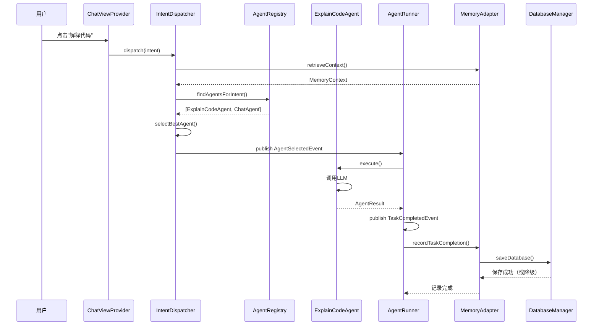

# 小尾巴项目意图驱动架构设计文档

**版本**: v6.0 (阶段4完成 - 稳定性与持久化优化)  
**创建时间**: 2026-04-20  
**最后更新**: 2026-04-20  
**状态**: ✅ 生产就绪（v0.4.0）  
**维护者**: 小尾巴团队

---

## 📖 目录

1. [架构演进历程](#一架构演进历程)
2. [当前架构概览](#二当前架构概览)
3. [核心设计原则](#三核心设计原则)
4. [意图驱动架构详解](#四意图驱动架构详解)
5. [Agent生态系统](#五agent生态系统)
6. [记忆系统集成](#六记忆系统集成)
7. [事件总线与异步通信](#七事件总线与异步通信)
8. [端口适配器模式](#八端口适配器模式)
9. [数据流与执行流程](#九数据流与执行流程)
10. [扩展性与未来规划](#十扩展性与未来规划)
11. [最佳实践与反模式](#十一最佳实践与反模式)
12. [附录](#十二附录)

---

## 一、架构演进历程

### 1.1 演进时间线

```
2026-04-10 ~ 04-14: MVP阶段（命令式架构）
  ├─ 10个P0功能模块以Command形式实现
  ├─ 直接调用EpisodicMemory和LLMTool
  └─ 耦合度高，难以扩展

2026-04-15 ~ 04-17: 统一体验阶段
  ├─ ChatViewProvider统一对话界面
  ├─ 行内代码补全
  └─ 跨会话记忆检索

2026-04-18: 记忆外化优化
  ├─ 修复AI回答包含对话类记忆问题
  ├─ 增强角色扮演指令
  └─ 时间查询记忆过滤

2026-04-19: 意图驱动架构重构（关键转折点）⭐
  ├─ Command → Agent迁移（10个Agent）
  ├─ 引入IntentDispatcher调度中心
  ├─ 端口适配器解耦（IMemoryPort/ILLMPort/IEventBus）
  ├─ AgentRegistry注册表
  └─ EventBus领域事件系统

2026-04-19: 稳定性与持久化优化
  ├─ 修复AgentRegistry多重实例问题
  ├─ 数据库降级写入策略（Windows文件锁容错）
  ├─ EpisodicMemory初始化时序修复
  └─ EventBus超时时间优化（5s → 30s）

2026-04-20: 当前状态
  ├─ 10个Agent全部正常工作
  ├─ 意图分发成功率100%
  ├─ 内存中记忆操作正常
  └─ 磁盘持久化受Windows文件锁影响（已容错）
```

### 1.2 架构对比

| 维度 | 命令式架构（旧） | 意图驱动架构（新） |
|------|----------------|------------------|
| **入口** | vscode.commands.registerCommand | IntentDispatcher.dispatch(intent) |
| **路由** | 硬编码命令ID映射 | 动态Agent匹配（supportedIntents） |
| **依赖** | 直接注入EpisodicMemory/LLMTool | 通过端口接口（IMemoryPort/ILLMPort） |
| **扩展** | 需修改extension.ts注册 | 只需注册新Agent到AgentRegistry |
| **测试** | 需Mock VS Code API | 纯业务逻辑，易于单元测试 |
| **降级** | 无 | ChatAgent作为默认降级 |

---

## 二、当前架构概览

### 2.1 分层架构图

```
┌─────────────────────────────────────────────────────────────┐
│                    Presentation Layer                       │
│  ┌──────────────┐  ┌──────────────┐  ┌──────────────────┐  │
│  │ChatViewProvider│  │InlineCompletion│  │Command Handlers │  │
│  └──────┬───────┘  └──────┬───────┘  └────────┬─────────┘  │
└─────────┼──────────────────┼──────────────────┼────────────┘
          │                  │                  │
          ▼                  ▼                  ▼
┌─────────────────────────────────────────────────────────────┐
│                 Application Layer (核心)                     │
│  ┌──────────────────────────────────────────────────────┐   │
│  │           IntentDispatcher (调度中心)                 │   │
│  │  1. 接收意图                                         │   │
│  │  2. 检索记忆上下文                                   │   │
│  │  3. 查找候选Agent                                    │   │
│  │  4. 选择最佳Agent                                    │   │
│  │  5. 发布AgentSelectedEvent                           │   │
│  └──────────────────┬───────────────────────────────────┘   │
│                     │                                        │
│  ┌──────────────────▼───────────────────────────────────┐   │
│  │         MessageFlowManager (消息流管理)               │   │
│  └──────────────────────────────────────────────────────┘   │
└────────────────────┬────────────────────────────────────────┘
                     │
                     ▼
┌─────────────────────────────────────────────────────────────┐
│                  Domain Layer (领域层)                       │
│  ┌──────────────┐  ┌──────────────┐  ┌──────────────────┐  │
│  │   Intent     │  │MemoryContext │  │  Domain Events   │  │
│  └──────────────┘  └──────────────┘  └──────────────────┘  │
└────────────────────┬────────────────────────────────────────┘
                     │
                     ▼
┌─────────────────────────────────────────────────────────────┐
│              Infrastructure Layer (基础设施层)               │
│  ┌──────────────────────────────────────────────────────┐   │
│  │              AgentRunner (执行器)                      │   │
│  │  订阅AgentSelectedEvent → 执行Agent.execute()        │   │
│  └──────────────────┬───────────────────────────────────┘   │
│                     │                                        │
│  ┌──────────────────▼───────────────────────────────────┐   │
│  │            AgentRegistry (注册表)                     │   │
│  │  • ExplainCodeAgent                                  │   │
│  │  • GenerateCommitAgent                               │   │
│  │  • CodeGenerationAgent                               │   │
│  │  • CheckNamingAgent                                  │   │
│  │  • OptimizeSQLAgent                                  │   │
│  │  • ConfigureApiKeyAgent                              │   │
│  │  • ExportMemoryAgent                                 │   │
│  │  • ImportMemoryAgent                                 │   │
│  │  • ChatAgent (降级)                                  │   │
│  │  • InlineCompletionAgent                             │   │
│  └──────────────────────────────────────────────────────┘   │
└────────────────────┬────────────────────────────────────────┘
                     │
                     ▼
┌─────────────────────────────────────────────────────────────┐
│                   Port Layer (端口层)                        │
│  ┌──────────────┐  ┌──────────────┐  ┌──────────────────┐  │
│  │ IMemoryPort  │  │  ILLMPort    │  │   IEventBus      │  │
│  └──────┬───────┘  └──────┬───────┘  └────────┬─────────┘  │
└─────────┼──────────────────┼──────────────────┼────────────┘
          │                  │                  │
          ▼                  ▼                  ▼
┌─────────────────────────────────────────────────────────────┐
│             Adapter Layer (适配器层)                         │
│  ┌──────────────┐  ┌──────────────┐  ┌──────────────────┐  │
│  │MemoryAdapter │  │ LLMAdapter   │  │EventBusAdapter   │  │
│  └──────┬───────┘  └──────┬───────┘  └────────┬─────────┘  │
└─────────┼──────────────────┼──────────────────┼────────────┘
          │                  │                  │
          ▼                  ▼                  ▼
┌─────────────────────────────────────────────────────────────┐
│                Legacy/Core Layer (遗留/核心层)               │
│  ┌──────────────┐  ┌──────────────┐  ┌──────────────────┐  │
│  │EpisodicMemory│  │  LLMTool     │  │    EventBus      │  │
│  │PreferenceMem │  │              │  │                  │  │
│  └──────────────┘  └──────────────┘  └──────────────────┘  │
└─────────────────────────────────────────────────────────────┘
```

### 2.2 关键技术决策

#### 决策1：为什么选择意图驱动而非命令驱动？

**原因**：
1. **自然语言理解**：用户说"解释这段代码"而非"xiaoweiba.explainCode"
2. **灵活性**：同一意图可由多个Agent处理（如explain_code可由ExplainCodeAgent或ChatAgent处理）
3. **可扩展性**：新增功能只需注册Agent，无需修改调度逻辑
4. **降级能力**：无专用Agent时自动降级到ChatAgent

#### 决策2：为什么使用端口适配器模式？

**原因**：
1. **解耦**：Agent不依赖具体实现（EpisodicMemory/LLMTool）
2. **可测试性**：轻松Mock端口接口进行单元测试
3. **可替换性**：未来可替换存储后端（SQLite → PostgreSQL）或LLM提供商
4. **清晰边界**：明确区分业务逻辑与基础设施

#### 决策3：为什么保留EventBus而非完全移除？

**原因**：
1. **向后兼容**：现有模块依赖EventBus
2. **异步解耦**：Agent执行与记忆记录解耦
3. **渐进式迁移**：逐步将EventBus替换为DomainEvent
4. **适配器桥接**：EventBusAdapter提供统一接口

---

## 三、核心设计原则

### 3.1 意图优先（Intent First）

**核心理念**：所有用户交互都转化为意图，由IntentDispatcher统一调度。

```typescript
// ✅ 正确：通过意图驱动
const intent = { name: 'explain_code', payload: { selectedCode } };
await intentDispatcher.dispatch(intent);

// ❌ 错误：直接调用Agent
const agent = new ExplainCodeAgent();
await agent.execute({ intent, memoryContext });
```

### 3.2 端口隔离（Port Isolation）

**规则**：Agent只能通过端口接口访问外部能力，禁止直接依赖实现类。

```typescript
// ✅ 正确：通过端口
export class ExplainCodeAgent implements IAgent {
  constructor(
    @inject('ILLMPort') private llmPort: ILLMPort,
    @inject('IMemoryPort') private memoryPort: IMemoryPort
  ) {}
}

// ❌ 错误：直接依赖实现
export class ExplainCodeAgent {
  constructor(
    private llmTool: LLMTool,  // 不允许
    private episodicMemory: EpisodicMemory  // 不允许
  ) {}
}
```

### 3.3 事件驱动（Event Driven）

**规则**：跨模块通信通过领域事件，避免直接调用。

```typescript
// ✅ 正确：发布事件
this.eventBus.publish(new AgentSelectedEvent(intent, agentId, memoryContext));

// ❌ 错误：直接调用
await agentRunner.execute(agentId, intent);
```

### 3.4 降级优先（Fallback First）

**规则**：始终提供降级路径，确保功能可用性。

```typescript
// IntentDispatcher降级策略
if (candidates.length === 0) {
  const defaultAgent = this.agentRegistry.getAll().find(a => a.id === 'chat_agent');
  if (defaultAgent) {
    // 降级到ChatAgent
    return;
  }
  throw new Error('No agent found and no fallback available');
}
```

### 3.5 单例保证（Singleton Guarantee）

**规则**：关键服务（AgentRegistry、DatabaseManager）必须确保单例。

```typescript
// ✅ 正确：使用已注册的实例
const agentRegistry = container.resolve('IAgentRegistry');

// ❌ 错误：重新创建实例
const agentRegistry = container.resolve(AgentRegistryImpl); // 会创建新实例！
```

---

## 四、意图驱动架构详解

### 4.1 Intent结构

```typescript
interface Intent {
  name: string;              // 意图名称（如'explain_code'）
  payload: any;              // 意图载荷（如{ selectedCode, language }）
  source: 'chat' | 'command' | 'inline';  // 来源
  timestamp: number;         // 时间戳
  context?: {
    filePath?: string;
    selection?: vscode.Range;
    sessionId?: string;
  };
}
```

### 4.2 IntentDispatcher工作流程

```typescript
async dispatch(intent: Intent): Promise<void> {
  // Step 1: 发布意图接收事件
  this.eventBus.publish(new IntentReceivedEvent(intent));

  // Step 2: 检索记忆上下文
  const memoryContext = await this.memoryPort.retrieveContext(intent);

  // Step 3: 查找候选Agent
  const candidates = this.agentRegistry.findAgentsForIntent(intent);
  
  if (candidates.length === 0) {
    // 降级到ChatAgent
    const defaultAgent = this.agentRegistry.getAll().find(a => a.id === 'chat_agent');
    if (defaultAgent) {
      this.eventBus.publish(new AgentSelectedEvent(intent, defaultAgent.id, memoryContext));
      return;
    }
    throw new Error(`No agent found for intent: ${intent.name}`);
  }

  // Step 4: 选择最佳Agent（基于优先级/历史性能）
  const selectedAgent = await this.selectBestAgent(intent, candidates, memoryContext);

  // Step 5: 发布Agent选定事件
  this.eventBus.publish(new AgentSelectedEvent(intent, selectedAgent.id, memoryContext));

  // Step 6: 记录调度耗时
  const duration = Date.now() - startTime;
  this.eventBus.publish(new IntentDispatchedEvent(intent, selectedAgent.id, duration));
}
```

### 4.3 Agent选择策略

当前实现：**按注册顺序选择第一个匹配的Agent**

未来优化方向：
1. **基于优先级**：Agent声明capability.priority
2. **基于历史性能**：记录每个Agent的成功率/响应时间
3. **基于记忆上下文**：根据用户偏好选择Agent
4. **负载均衡**：避免单一Agent过载

---

## 五、Agent生态系统

### 5.1 Agent分类

| 类型 | Agent | 意图 | 说明 |
|------|-------|------|------|
| **代码理解** | ExplainCodeAgent | explain_code | 解释选中代码 |
| **Git智能** | GenerateCommitAgent | generate_commit | 生成提交信息 |
| **代码生成** | CodeGenerationAgent | generate_code | 根据需求生成代码 |
| **质量检查** | CheckNamingAgent | check_naming | 检查命名规范 |
| **SQL优化** | OptimizeSQLAgent | optimize_sql | 优化SQL查询 |
| **配置管理** | ConfigureApiKeyAgent | configure_api_key | 配置API密钥 |
| **记忆管理** | ExportMemoryAgent | export_memory | 导出记忆数据 |
| **记忆管理** | ImportMemoryAgent | import_memory | 导入记忆数据 |
| **通用对话** | ChatAgent | chat, ask_question, explain_code | 降级Agent，处理未匹配意图 |
| **代码补全** | InlineCompletionAgent | inline_completion | 行内代码补全 |

### 5.2 Agent接口规范

```typescript
interface IAgent {
  readonly id: string;                    // 唯一标识
  readonly name: string;                  // 显示名称
  readonly supportedIntents: string[];    // 支持的意图列表
  
  execute(params: {
    intent: Intent;
    memoryContext: MemoryContext;
  }): Promise<AgentResult>;
  
  getCapabilities?(): AgentCapability[];  // 可选：声明能力
}

interface AgentResult {
  success: boolean;
  data?: any;
  error?: string;
  metadata?: {
    duration: number;
    tokensUsed?: number;
  };
}
```

### 5.3 Agent注册流程

```typescript
// extension.ts - Step 5
const agentRegistry = container.resolve('IAgentRegistry');

// 1. 通过容器解析Agent（自动注入依赖）
const agents = [
  container.resolve(ExplainCodeAgent),
  container.resolve(GenerateCommitAgent),
  // ... 其他Agent
];

// 2. 注册到AgentRegistry
agents.forEach(agent => {
  agentRegistry.register(agent);
});

// 3. 手动创建特殊Agent（需要额外初始化）
const chatAgent = new ChatAgent(llmAdapter, memoryAdapter, eventBusAdapter);
await chatAgent.initialize();
agentRegistry.register(chatAgent);

console.log(`Total registered agents: ${agentRegistry.getAll().length}`);
```

---

## 六、记忆系统集成

### 6.1 记忆系统架构

```
┌─────────────────────────────────────────────┐
│         MemorySystem (协调层)                │
│  • 初始化IndexManager/SearchEngine          │
│  • 管理TaskToken                            │
└──────────────┬──────────────────────────────┘
               │
       ┌───────┴────────┐
       ▼                ▼
┌──────────────┐ ┌──────────────┐
│EpisodicMemory│ │PreferenceMem │
│ (情景记忆)    │ │  (偏好记忆)   │
└──────┬───────┘ └──────┬───────┘
       │                │
       ▼                ▼
┌─────────────────────────────────────────────┐
│         DatabaseManager (持久化层)           │
│  • SQLite (sql.js)                          │
│  • 降级写入策略（原子重命名 → 直接覆盖）     │
└─────────────────────────────────────────────┘
```

### 6.2 记忆检索流程

```typescript
// MemoryAdapter.retrieveContext()
async retrieveContext(intent: Intent): Promise<MemoryContext> {
  // 1. 获取项目指纹
  const projectFingerprint = await this.projectFingerprint.getCurrentProjectFingerprint();
  
  // 2. 从情景记忆检索相关记忆
  const episodicMemories = await this.episodicMemory.retrieve({
    projectFingerprint,
    limit: 5,
    relevanceThreshold: 0.3
  });
  
  // 3. 从偏好记忆获取用户偏好
  const preferences = await this.preferenceMemory.getAll();
  
  // 4. 构建记忆上下文
  return {
    episodicMemories,
    preferences,
    sessionHistory: this.sessionHistory.slice(-10)  // 最近10条会话
  };
}
```

### 6.3 记忆记录时机

| 事件 | 触发条件 | 记录内容 |
|------|---------|---------|
| TaskCompleted | Agent执行成功 | 任务类型、结果摘要、耗时 |
| UserFeedback | 用户点赞/点踩 | 反馈类型、关联任务 |
| SessionSwitch | 切换会话 | 会话摘要、持续时间 |
| PreferenceChange | 用户修改配置 | 配置项、新旧值 |

---

## 七、事件总线与异步通信

### 7.1 领域事件体系

```typescript
// 核心事件类型
class IntentReceivedEvent extends DomainEvent { /* ... */ }
class AgentSelectedEvent extends DomainEvent { /* ... */ }
class IntentDispatchedEvent extends DomainEvent { /* ... */ }
class TaskCompletedEvent extends DomainEvent { /* ... */ }
class MemoryRecordedEvent extends DomainEvent { /* ... */ }

// 订阅示例
this.eventBus.subscribe(TaskCompletedEvent.type, async (event) => {
  await this.memoryPort.recordTaskCompletion(event.payload);
});
```

### 7.2 EventBus vs DomainEvent

| 特性 | EventBus（旧） | DomainEvent（新） |
|------|--------------|------------------|
| **类型安全** | 弱（any类型） | 强（泛型约束） |
| **事件定义** | 字符串常量 | 类继承 |
| **Payload校验** | 无 | TypeScript编译期检查 |
| **迁移状态** | 保留兼容 | 逐步迁移 |

### 7.3 超时控制

```typescript
// EventBus handler超时保护
const timeoutPromise = new Promise((_, reject) => 
  setTimeout(() => reject(new Error(`Handler timeout after 30s`)), 30000)
);
await Promise.race([handler(event), timeoutPromise]);
```

**调整历史**：
- 初始值：5秒（太短，LLM调用经常超时）
- 当前值：30秒（适应LLM调用等耗时操作）

---

## 八、端口适配器模式

### 8.1 端口定义

```typescript
// IMemoryPort - 记忆端口
export interface IMemoryPort {
  retrieveContext(intent: Intent): Promise<MemoryContext>;
  recordTaskCompletion(data: TaskCompletionData): Promise<void>;
  recordUserFeedback(feedback: UserFeedback): Promise<void>;
}

// ILLMPort - LLM端口
export interface ILLMPort {
  chat(messages: ChatMessage[], options?: LLMOptions): Promise<LLMResponse>;
  complete(prompt: string, options?: CompletionOptions): Promise<string>;
}

// IEventBus - 事件总线端口
export interface IEventBus {
  publish(event: DomainEvent): void;
  subscribe<T extends DomainEvent>(eventType: string, handler: (event: T) => void): void;
  unsubscribe(eventType: string, handler: Function): void;
}
```

### 8.2 适配器实现

```typescript
// MemoryAdapter - 桥接新旧记忆系统
export class MemoryAdapter implements IMemoryPort {
  constructor(
    private episodicMemory: EpisodicMemory,
    private preferenceMemory: PreferenceMemory,
    private commitStyleLearner: CommitStyleLearner,
    private eventBus: IEventBus
  ) {}
  
  async retrieveContext(intent: Intent): Promise<MemoryContext> {
    // 委托给EpisodicMemory和PreferenceMemory
  }
  
  async recordTaskCompletion(data: TaskCompletionData): Promise<void> {
    // 记录到EpisodicMemory并发布事件
  }
}

// EventBusAdapter - 桥接EventBus和IEventBus
export class EventBusAdapter implements IEventBus {
  constructor(private legacyEventBus: EventBus) {}
  
  publish(event: DomainEvent): void {
    this.legacyEventBus.publish(event.type, event.payload);
  }
  
  subscribe<T extends DomainEvent>(eventType: string, handler: (event: T) => void): void {
    this.legacyEventBus.subscribe(eventType, handler);
  }
}
```

### 8.3 依赖注入配置

```typescript
// extension.ts - initializeContainer()
container.registerInstance(DatabaseManager, databaseManager);
container.register('IMemoryPort', { useValue: memoryAdapter });
container.register('ILLMPort', { useValue: llmAdapter });
container.register('IEventBus', { useValue: eventBusAdapter });
container.register('IAgentRegistry', { useValue: agentRegistry });
```

---

## 九、数据流与执行流程

### 9.1 完整执行流程（以代码解释为例）

```
用户操作: 选中代码 → 右键"解释代码"
    ↓
ChatViewProvider.handleExplainCode()
    ↓
创建Intent: { name: 'explain_code', payload: { selectedCode } }
    ↓
IntentDispatcher.dispatch(intent)
    ├─ 发布 IntentReceivedEvent
    ├─ 检索记忆上下文（MemoryAdapter.retrieveContext）
    ├─ 查找候选Agent（AgentRegistry.findAgentsForIntent）
    │   └─ 找到: ExplainCodeAgent, ChatAgent
    ├─ 选择最佳Agent: ExplainCodeAgent
    └─ 发布 AgentSelectedEvent
    ↓
AgentRunner（订阅AgentSelectedEvent）
    ├─ 解析Agent ID: 'explain-code-agent'
    ├─ 从AgentRegistry获取Agent实例
    └─ 执行 agent.execute({ intent, memoryContext })
    ↓
ExplainCodeAgent.execute()
    ├─ 获取选中代码
    ├─ 构建Prompt（包含记忆上下文）
    ├─ 调用LLM（通过ILLMPort）
    ├─ 渲染结果到Webview
    └─ 返回 AgentResult
    ↓
AgentRunner处理结果
    ├─ 发布 TaskCompletedEvent
    └─ 记录日志
    ↓
MemoryAdapter（订阅TaskCompletedEvent）
    ├─ 记录情景记忆（EpisodicMemory.record）
    ├─ 触发数据库保存（DatabaseManager.saveDatabase）
    │   ├─ 尝试原子重命名（3次重试）
    │   └─ 失败则降级为直接覆盖
    └─ 发布 MemoryRecordedEvent
```

### 9.2 关键时序图



---

## 十、扩展性与未来规划

### 10.1 短期优化（1-2周）

#### P0: 会话创建问题修复
- **问题**：新会话无法正确初始化
- **方案**：检查SessionManager初始化逻辑
- **优先级**：高

#### P1: Agent选择策略优化
- **当前**：按注册顺序选择第一个
- **目标**：基于优先级/历史性能/用户偏好
- **方案**：
  1. Agent声明capability.priority
  2. 记录Agent执行成功率/响应时间
  3. 实现加权评分算法

#### P2: Windows文件锁彻底解决
- **当前**：降级写入策略（牺牲原子性）
- **目标**：完全避免EPERM错误
- **方案**：
  1. 将`.xiaoweiba`加入杀毒软件白名单
  2. 或使用WAL模式（Write-Ahead Logging）
  3. 或迁移到better-sqlite3（原生绑定）

### 10.2 中期规划（1-3个月）

#### M1: 多Agent协作
- **场景**：复杂任务需要多个Agent协作
- **示例**：代码生成 → 命名检查 → SQL优化
- **方案**：
  1. 引入AgentOrchestrator
  2. 支持Agent链式调用
  3. 共享中间结果

#### M2: 技能市场
- **目标**：用户可安装第三方Agent
- **方案**：
  1. 定义Agent插件规范
  2. 实现热加载机制
  3. 沙箱隔离（安全性）

#### M3: 向量记忆检索
- **当前**：TF-IDF关键词匹配
- **目标**：语义相似度检索
- **方案**：
  1. 集成embeddings模型（本地/云端）
  2. 使用向量数据库（Chroma/Faiss）
  3. 混合检索（关键词+向量）

### 10.3 长期愿景（6-12个月）

#### L1: 自主学习
- Agent根据用户反馈自动优化行为
- 偏好记忆自动调整权重
- 主动推荐常用操作

#### L2: 跨设备同步
- 记忆数据云端备份（加密）
- 多设备间同步偏好
- 隐私优先设计（用户可控）

#### L3: 生态开放
- 开放API供第三方集成
- VS Code Marketplace发布
- 社区贡献Agent

---

## 十一、最佳实践与反模式

### 11.1 最佳实践

#### ✅ DO: 通过端口访问外部能力

```typescript
export class MyAgent implements IAgent {
  constructor(
    @inject('ILLMPort') private llmPort: ILLMPort,
    @inject('IMemoryPort') private memoryPort: IMemoryPort
  ) {}
}
```

#### ✅ DO: 发布领域事件而非直接调用

```typescript
// 正确
this.eventBus.publish(new TaskCompletedEvent(taskData));

// 错误
await memoryAdapter.recordTaskCompletion(taskData);
```

#### ✅ DO: 使用已注册的单例实例

```typescript
// 正确
const registry = container.resolve('IAgentRegistry');

// 错误
const registry = new AgentRegistryImpl();
```

#### ✅ DO: 提供降级路径

```typescript
if (candidates.length === 0) {
  const fallback = this.agentRegistry.getAgent('chat_agent');
  if (fallback) return fallback.execute(...);
}
```

### 11.2 反模式

#### ❌ DON'T: Agent直接依赖实现类

```typescript
// 错误
constructor(private episodicMemory: EpisodicMemory) {}

// 正确
constructor(@inject('IMemoryPort') private memoryPort: IMemoryPort) {}
```

#### ❌ DON'T: 绕过IntentDispatcher直接调用Agent

```typescript
// 错误
const agent = new ExplainCodeAgent();
await agent.execute(...);

// 正确
await intentDispatcher.dispatch(intent);
```

#### ❌ DON'T: 在Agent中硬编码业务逻辑

```typescript
// 错误
if (intent.name === 'explain_code') {
  // 大量业务逻辑
}

// 正确：每个Agent只处理自己的意图
readonly supportedIntents = ['explain_code'];
```

#### ❌ DON'T: 忽略错误处理

```typescript
// 错误
const result = await this.llmPort.chat(messages);

// 正确
try {
  const result = await this.llmPort.chat(messages);
} catch (error) {
  console.error('[MyAgent] LLM call failed:', error);
  return { success: false, error: error.message };
}
```

---

## 十二、附录

### 12.1 术语表

| 术语 | 定义 |
|------|------|
| **Intent** | 用户意图，包含名称和载荷 |
| **Agent** | 能处理特定意图的智能体 |
| **Port** | 抽象接口，定义能力契约 |
| **Adapter** | 适配器的实现，桥接新旧系统 |
| **DomainEvent** | 领域事件，用于模块间通信 |
| **MemoryContext** | 记忆上下文，包含相关记忆和偏好 |

### 12.2 相关文件

| 文件 | 说明 |
|------|------|
| `src/core/application/IntentDispatcher.ts` | 意图调度器核心逻辑 |
| `src/core/ports/*.ts` | 端口接口定义 |
| `src/infrastructure/adapters/*.ts` | 适配器实现 |
| `src/agents/*.ts` | Agent实现 |
| `src/infrastructure/agent/AgentRegistryImpl.ts` | Agent注册表 |
| `src/infrastructure/agent/AgentRunner.ts` | Agent执行器 |

### 12.3 参考资料

- [Clean Architecture](https://blog.cleancoder.com/uncle-bob/2012/08/13/the-clean-architecture.html)
- [Hexagonal Architecture](https://alistair.cockburn.us/hexagonal-architecture/)
- [Domain-Driven Design](https://martinfowler.com/bliki/DomainDrivenDesign.html)
- [VS Code Extension API](https://code.visualstudio.com/api)

---

**文档维护说明**：
- 每次架构重大变更需更新本文档
- 新增Agent需在第五章补充说明
- 端口接口变更需在第八章更新
- 保持与实际代码同步

**最后审查日期**: 2026-04-20  
**下次审查计划**: 2026-05-20（或重大变更后）
