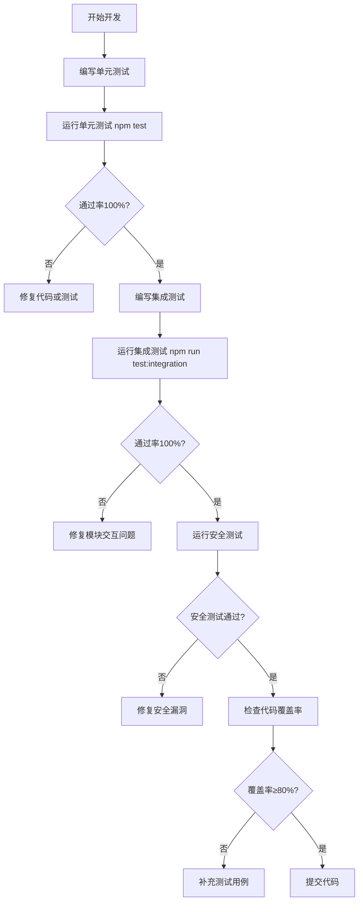

# 🧪 小尾巴（xiaoweiba）测试标准及流程规范

**版本**: v1.0  
**生效日期**: 2026-04-15  
**适用范围**: 所有新功能开发和Bug修复  
**目标覆盖率**: ≥80%

---

## 📋 一、测试分层标准

### 1.1 单元测试（Unit Tests）

**覆盖范围**:
- ✅ 所有核心业务逻辑类
- ✅ 工具函数和辅助方法
- ✅ 数据转换和验证逻辑

**最低要求**:
```typescript
// 每个公共方法至少3个测试用例
describe('ClassName', () => {
  it('应该正确处理正常输入', () => {});
  it('应该正确处理边界条件', () => {});
  it('应该在异常情况下抛出错误', () => {});
});
```

**质量标准**:
- 单个测试文件覆盖率 ≥ 80%
- 断言必须明确（避免`expect(true).toBe(true)`）
- Mock外部依赖（数据库、LLM API、文件系统）
- 测试执行时间 < 5秒/文件

---

### 1.2 集成测试（Integration Tests）

**覆盖范围**:
- ✅ 模块间交互（如Command → Memory → Database）
- ✅ 完整业务流程（如代码解释的端到端流程）
- ✅ 真实数据库操作（使用内存数据库）

**测试矩阵示例**:

| 功能 | 涉及的模块 | 测试场景 | 预期结果 |
|------|-----------|---------|---------|
| 代码解释 | ExplainCodeCommand + EpisodicMemory + LLMTool | 选中代码后调用解释 | 返回解释文本并记录记忆 |
| 提交生成 | GenerateCommitCommand + GitTool + AuditLogger | 有Git变更时生成提交信息 | 返回符合规范的提交消息 |
| 记忆导出 | ExportMemoryCommand + EpisodicMemory + FileSystem | 导出当前项目记忆 | 生成JSON文件且内容正确 |

**执行要求**:
- 使用真实的依赖注入容器
- 清理测试数据（beforeEach/afterEach）
- 模拟用户交互（vscode.window.showInformationMessage等）

---

### 1.3 安全测试（Security Tests）

**强制要求** - 每次修改涉及以下模块时必须执行：

#### SQL注入防护测试
```typescript
it('应该防止SQL注入攻击', async () => {
  const maliciousInput = "'; DROP TABLE episodic_memory; --";
  await episodicMemory.retrieve({ taskType: maliciousInput });
  
  // 验证表仍然存在
  const stats = await episodicMemory.getStats();
  expect(stats.totalCount).toBeDefined();
});
```

#### XSS防护测试
```typescript
it('应该转义Webview中的恶意脚本', () => {
  const maliciousContent = '<script>alert("XSS")</script>';
  const html = command.generateExplanationHtml(maliciousContent, 'code', 'ts');
  
  expect(html).not.toContain('<script>');
  expect(html).toContain('&lt;script&gt;');
});
```

#### 参数化查询验证
```typescript
it('应该使用参数化查询而非字符串拼接', () => {
  const dbMock = { prepare: jest.fn(), exec: jest.fn() };
  
  episodicMemory.retrieve({ taskType: 'test' });
  
  expect(dbMock.prepare).toHaveBeenCalled();
  expect(dbMock.exec).not.toHaveBeenCalledWith(
    expect.stringContaining("'test'")
  );
});
```

---

## 🔄 二、测试执行流程

### 2.1 开发阶段测试流程



### 2.2 具体执行命令

```bash
# 1. 运行所有单元测试
npm test

# 2. 运行特定模块的测试
npm test -- tests/unit/memory/EpisodicMemory.test.ts

# 3. 运行集成测试
npm run test:integration

# 4. 查看覆盖率报告
npm test -- --coverage

# 5. 生成HTML覆盖率报告
npm test -- --coverage --coverageReporters=html
```

---

## 📊 三、测试覆盖率要求

### 3.1 覆盖率阈值

| 指标 | 最低要求 | 目标值 | 优秀标准 |
|------|---------|--------|---------|
| **语句覆盖率** | 75% | 80% | 90% |
| **分支覆盖率** | 70% | 75% | 85% |
| **函数覆盖率** | 80% | 85% | 95% |
| **行覆盖率** | 75% | 80% | 90% |

### 3.2 豁免规则

以下情况可申请覆盖率豁免（需在PR中说明）：
- VS Code API调用（难以Mock的部分）
- 纯UI渲染逻辑（Webview HTML生成）
- 第三方库包装器（已有完善测试）

---

## 🔍 四、代码审查中的测试检查清单

### 4.1 提交前自查

开发者在提交PR前必须确认：

- [ ] 新增代码有对应的单元测试
- [ ] 修改的代码更新了相关测试
- [ ] 所有测试用例通过（`npm test`）
- [ ] 覆盖率未下降超过5%
- [ ] 安全测试用例已添加（如涉及SQL/Webview）
- [ ] 集成测试覆盖了关键路径

### 4.2 审查者检查项

审查者在Code Review时必须验证：

- [ ] 测试用例命名清晰（描述行为而非实现）
- [ ] Mock策略合理（不过度Mock）
- [ ] 边界条件和异常情况已覆盖
- [ ] 测试独立性强（不依赖执行顺序）
- [ ] 没有硬编码的魔法数字
- [ ] 异步测试正确使用async/await

---

## 🛡️ 五、安全测试专项要求

### 5.1 必须覆盖的安全场景

#### SQL注入防护
- [ ] 所有用户输入都经过参数化处理
- [ ] ORDER BY/LIMIT等动态子句使用白名单验证
- [ ] 测试用例包含常见注入payload（`' OR 1=1 --`）

#### XSS防护
- [ ] Webview内容使用DOMPurify清理
- [ ] CSP策略配置正确（无unsafe-inline）
- [ ] 测试用例包含脚本标签和事件处理器

#### 敏感信息保护
- [ ] API Key不写入日志
- [ ] 审计日志中的用户输入脱敏
- [ ] .env文件在.gitignore中

### 5.2 自动化安全扫描

```bash
# 安装安全扫描工具
npm install --save-dev eslint-plugin-security

# 运行安全检查
npx eslint src/ --plugin security

# 依赖漏洞扫描
npm audit
npm audit fix
```

---

## 📝 六、测试文档同步要求

### 6.1 测试报告更新

每次重大功能完成后，必须更新 `docs/test-report.md`：

```markdown
## 测试报告 - v0.1.0

### 测试概况
- 测试用例总数: 259
- 通过率: 100%
- 覆盖率: 80.23%

### 新增测试
- EpisodicMemory: +5用例（SQL注入防护）
- ChatViewProvider: +8用例（XSS防护）
- AICompletionProvider: +6用例（性能优化）

### 已知问题
- 无
```

### 6.2 Bug修复记录

修复Bug后必须更新 `docs/bugfix-summary.md`：

```markdown
## Bug修复记录

### Bug #X: SQL注入漏洞
- **发现时间**: 2026-04-15
- **影响模块**: EpisodicMemory.ts
- **修复方案**: 使用prepare/bind参数化查询
- **测试验证**: 新增3个安全测试用例
- **回归测试**: 所有原有测试通过
```

---

## 🚀 七、持续集成（CI）流程

### 7.1 GitHub Actions配置（建议）

```yaml
name: Test Suite
on: [push, pull_request]

jobs:
  test:
    runs-on: ubuntu-latest
    steps:
      - uses: actions/checkout@v3
      - uses: actions/setup-node@v3
        with:
          node-version: '18'
      
      - name: Install dependencies
        run: npm ci
      
      - name: Run unit tests
        run: npm test
      
      - name: Run integration tests
        run: npm run test:integration
      
      - name: Check coverage
        run: |
          npm test -- --coverage --coverageThreshold='{"global":{"lines":80}}'
      
      - name: Security audit
        run: npm audit --production
```

### 7.2 本地预提交钩子（可选）

```bash
# .husky/pre-commit
#!/bin/sh
npm test
npm run test:integration
```

---

## 🎯 八、测试最佳实践

### 8.1 测试命名规范

```typescript
// ✅ 好：描述行为和预期结果
it('应该在任务类型不匹配时返回空数组', async () => {});

// ❌ 坏：描述实现细节
it('应该调用db.exec方法', async () => {});
```

### 8.2 Arrange-Act-Assert模式

```typescript
it('应该正确检索情景记忆', async () => {
  // Arrange - 准备测试数据
  const memory = await episodicMemory.record({
    taskType: 'CODE_EXPLAIN',
    summary: '测试记忆',
    outcome: 'SUCCESS'
  });

  // Act - 执行被测操作
  const results = await episodicMemory.retrieve({
    taskType: 'CODE_EXPLAIN'
  });

  // Assert - 验证结果
  expect(results).toHaveLength(1);
  expect(results[0].summary).toBe('测试记忆');
});
```

### 8.3 Mock策略

```typescript
// ✅ 好：只Mock外部依赖
const llmToolMock = {
  call: jest.fn().mockResolvedValue({ success: true, data: 'result' })
};

// ❌ 坏：过度Mock内部逻辑
const episodicMemoryMock = {
  retrieve: jest.fn(),  // 不应该Mock被测对象本身
  record: jest.fn()
};
```

---

## 📌 九、常见问题FAQ

### Q1: 测试失败但代码看起来没问题？
**A**: 检查是否有异步操作未完成，确保使用`async/await`或返回Promise。

### Q2: 覆盖率突然下降？
**A**: 运行`npm test -- --coverage`查看详细报告，找出未覆盖的行并补充测试。

### Q3: 集成测试很慢？
**A**: 检查是否在beforeEach中重复初始化数据库，考虑使用全局setup。

### Q4: Mock VS Code API很困难？
**A**: 使用`tests/__mocks__/vscode.ts`中的预定义Mock，不要自己重新实现。

---

## ✅ 十、验收标准

### 新功能发布前的测试验收

- [ ] 单元测试通过率100%
- [ ] 集成测试通过率100%
- [ ] 代码覆盖率≥80%
- [ ] 安全测试全部通过
- [ ] 无npm audit高危漏洞
- [ ] 测试报告已更新
- [ ] Bug修复记录已同步

---

**文档维护者**: AI代码审查助手  
**最后更新**: 2026-04-15  
**下次审查**: v0.2.0发布前
